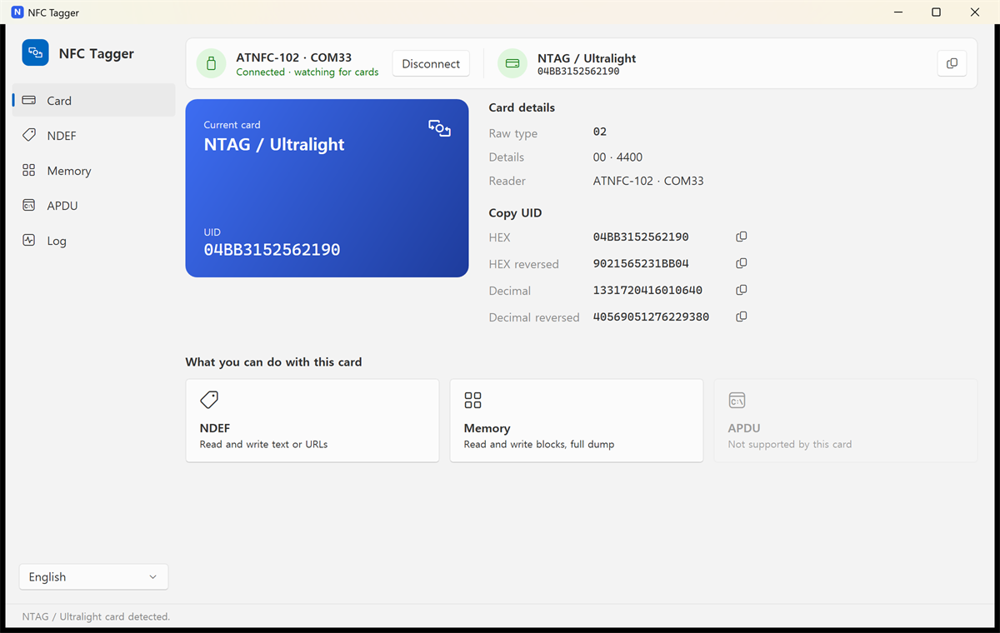

# NFC Tagger

NFC Tagger reads and writes NFC tags using ATNFC-102/103, ACR1552U, ACR122U and PCR532 readers. It runs on Windows and Linux (Ubuntu).



## Features

- Card type and UID, with UID copy in hex or decimal (normal or reversed byte order)
- NDEF text and URL records (read and write)
- Memory read and write by block, full dump saved as JSON
- Raw APDU exchange
- Finds connected readers and connects automatically

Writes are confirmed in a dialog first and read back afterwards to verify them. Protected areas such as manufacturer blocks and sector trailers are not written.

## Supported readers

| Reader | Connection | Notes |
| --- | --- | --- |
| ATNFC-102, ATNFC-103 | USB serial | |
| PCR532 | USB serial (PN532) | No ISO15693 |
| ACR1552U | PC/SC | Ubuntu 24.04 or later |
| ACR122U | PC/SC | No ISO15693 or FeliCa |

While connected to an ATNFC reader, the app turns off the reader's unsolicited reports (URC) and automatic beep, and turns them back on when it disconnects. Nothing is saved to the reader.

## Supported cards

| Card | NDEF | Memory | APDU |
| --- | :-: | :-: | :-: |
| NTAG / Ultralight | ✓ | ✓ | |
| MIFARE Classic | | ✓ | ACR readers only |
| ISO15693 | ✓ | ✓ | |
| FeliCa Lite-S | ✓ | ✓ | |
| ISO14443-4 | | | ✓ |

NDEF works on tags that are already NDEF formatted.

## Get the app

Download `NfcTagger-<version>-avalonia-win-x64.zip` (Windows) or `NfcTagger-<version>-avalonia-linux-x64.zip` (Linux) from [Releases](../../releases) and extract it. The .NET runtime is included, so there is nothing else to install. Settings are stored in `settings.json` next to the executable.

### Windows

Run `NfcTagger.exe`. Some readers may need a driver.

### Linux

```sh
unzip NfcTagger-*-avalonia-linux-x64.zip
cd NfcTagger-avalonia-linux-x64
chmod +x NfcTagger
./NfcTagger
```

A fresh Ubuntu install needs some setup before the readers can be used. In the app, open **Log** and click **Auto setup** under **Linux device setup**. After you enter the admin password, it installs pcscd and libccid, adds udev rules for the serial readers and blocks the `pn533_usb` kernel module, which otherwise claims the ACR122U. **Add to app menu** adds a launcher to the application menu.

The udev rule for the PCR532 matches every CH340 adapter (1a86:7523), and `pn533_usb` is blocked for the whole system. To undo the setup:

```sh
sudo rm /etc/udev/rules.d/70-nfc-tagger.rules /etc/modprobe.d/nfc-tagger-blacklist.conf
sudo udevadm control --reload-rules
sudo modprobe pn533_usb
```

pcscd and libccid stay installed.

The ACR1552U needs Ubuntu 24.04 or later, as 22.04 has no driver for it.

#### Troubleshooting

- **PCR532 not found**: brltty may have claimed its CH340 chip as a braille display. If you don't use one, run `sudo systemctl mask brltty-udev.service` and replug the reader.
- **ACR122U not found**: after the setup, replug the reader or restart the app.

## Build

Requires the .NET 10 SDK. On Windows, run:

```powershell
.\build.ps1
```

This creates the Windows and Linux zips in `dist`. If the execution policy blocks the script, run `build.cmd` instead.
